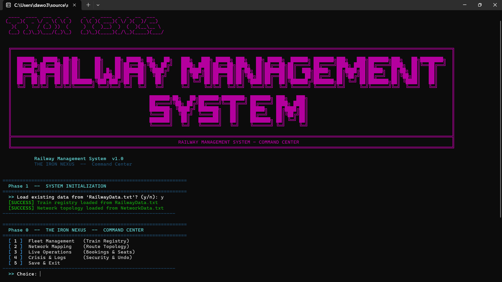
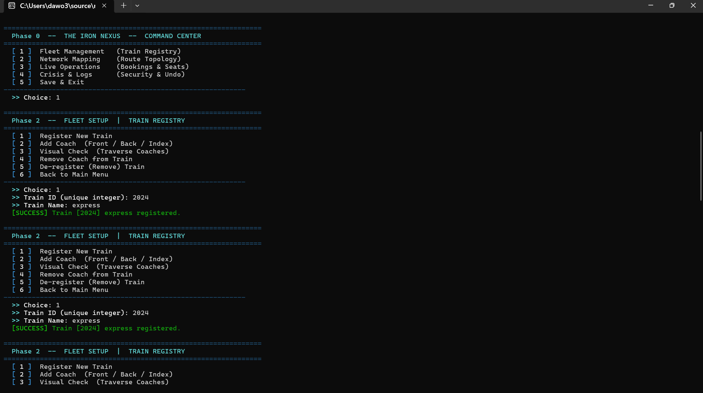
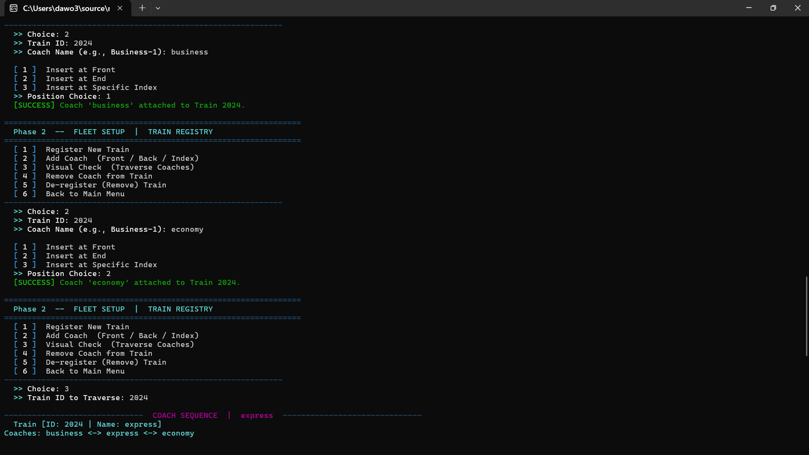
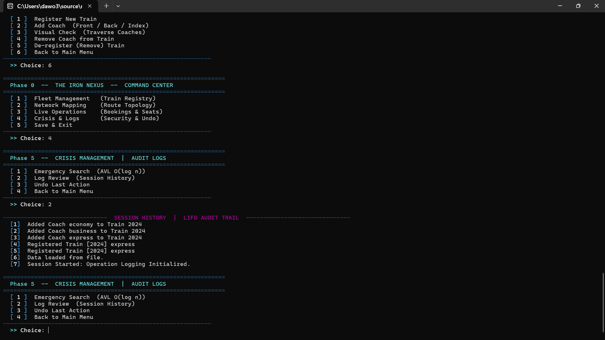

# 🚂 The Iron Nexus – Railway Management System

A comprehensive Railway Management System developed in **C++** as part of a Data Structures course project. The system simulates core railway operations by combining multiple custom-built data structures to efficiently manage trains, coaches, routes, bookings, and operational logs.

Unlike traditional implementations that rely heavily on STL containers, this project emphasizes **manual implementation of fundamental data structures**, demonstrating a deeper understanding of data organization, memory management, and algorithm design.

---

## 📖 Overview

The Iron Nexus is designed to model real-world railway operations through an integrated management platform. The system provides train registration, coach management, route planning, seat management, and operation tracking while utilizing several advanced data structures to optimize performance.

The project showcases how different data structures can work together within a single application to solve complex management problems efficiently.

---

## ✨ Features

### 🚆 Train Registry Management
- Add, update, search, and delete trains.
- Efficient train storage using an AVL Tree.
- Self-balancing operations ensure optimized search performance.

### 🚋 Coach Management
- Attach and detach coaches dynamically.
- Maintain coach ordering using a Doubly Linked List.
- Easy traversal in both directions.

### 🌐 Railway Network & Route Planning
- Represent railway stations and routes using Graphs.
- Analyze and manage railway connectivity.
- Support route-related operations.

### 🎫 Seat Management System
- Manage seat allocation and availability.
- Fast seat lookup through Hash Tables and BST structures.
- Efficient booking-related operations.

### 📋 Operation Logging
- Track user and system operations.
- Implemented using Stack and Queue structures.
- Supports history and processing workflows.

### 💾 Data Persistence
- Save and load railway data using file handling.
- Maintain records between program executions.

---

## 🏗️ Data Structures Implemented

This project includes custom implementations of:

| Data Structure | Purpose |
|--------------|---------|
| AVL Tree | Train Registry Management |
| Doubly Linked List | Coach Management |
| Graph | Railway Network Representation |
| Hash Table | Seat Lookup & Management |
| Binary Search Tree | Seat Organization |
| Queue | Request Processing |
| Stack | Operation Logging |
| File Handling | Data Persistence |

All major structures were implemented manually to strengthen understanding of core Data Structures concepts.

---

## 🛠️ Technologies Used

- **C++**
- **Object-Oriented Programming (OOP)**
- **File Handling**
- **Custom Data Structures**
- **Visual Studio**

---

## 📸 Screenshots

### Main Menu

### Train Registry

### Coach Registry

### Operation Logs

---

## 👥 Team Members

### Muhammad Dawood
**Data Structures Developer & System Integration**

Responsible for implementing core data structure components and integrating major system modules.

### Abdullah Kewan
**Railway Network & Storage Module Developer**

Contributed to route management functionality, system integration, and persistent storage features.

### Etizaz Ali
**Seat Management & Testing Engineer**

Worked on booking-related functionality, testing, debugging, and overall system validation.

---

## 🚀 How to Run

1. Open the project in Visual Studio.
2. Build the solution.
3. Run the application.
4. Navigate through the menu options to manage trains, coaches, routes, and seat operations.

---

## 🎯 Learning Outcomes

Through this project, we gained practical experience in:

- Designing complex systems using multiple data structures.
- Implementing AVL Trees and self-balancing mechanisms.
- Working with Graphs for network representation.
- Building custom Hash Tables and Linked Lists.
- Applying Object-Oriented Programming principles.
- Managing persistent data using file handling.
- Integrating multiple modules into a complete software solution.

---

## 🔮 Future Improvements

- Graphical User Interface (GUI)
- Advanced route optimization algorithms
- Online reservation simulation
- Passenger management module
- Real-time analytics dashboard
- Database integration

---

## 📜 Academic Project

This project was developed as part of the **Data Structures** course at **FAST National University of Computer and Emerging Sciences (FAST-NUCES)**.

---
